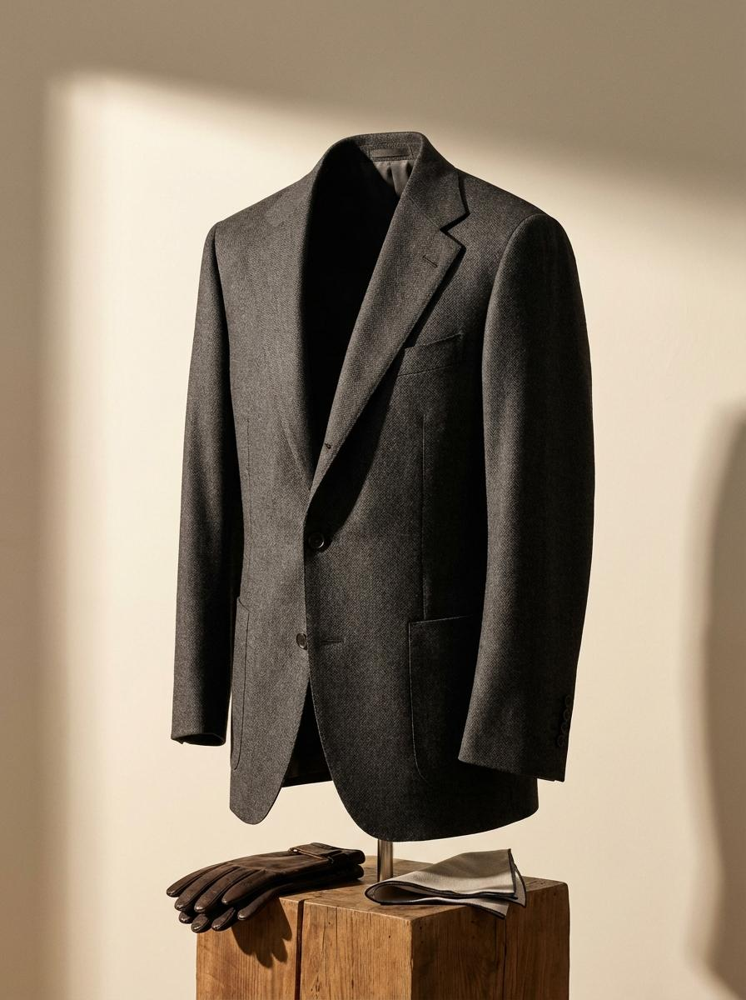

# Ligne Couture

**Bespoke Professional Wear — Dubai**

A premium made-to-measure suiting website featuring heritage-focused branding, direct mill partnerships, and an interactive fabric configurator.



## 🌐 Live Site

[https://7cnrgfsu3fvym.ok.kimi.link](https://7cnrgfsu3fvym.ok.kimi.link)

## ✨ Features

- **Heritage-Focused Branding** — Emphasizes European tailoring traditions (Savile Row, Naples, Biella)
- **Bespoke Studio** — Interactive fabric and silhouette selector
- **Direct Mill Partnerships** — Loro Piana, Scabal, Vitale Barberis, Holland & Sherry
- **Working Contact Form** — Connected to Formspree for enquiry handling
- **Responsive Design** — Mobile-first with elegant desktop experience
- **GSAP Animations** — Smooth scroll-triggered animations

## 🏛️ Sections

1. **Hero** — "The Art of True Bespoke Tailoring"
2. **What Went Wrong** — Critique of American vs European suiting
3. **Our Heritage** — The great houses of tailoring
4. **The Process** — 4-step bespoke journey
5. **Bespoke Studio** — Fabric & silhouette configurator
6. **Choose Your Line** — Essential, Heritage, Signature tiers
7. **Fabrics** — Climate adaptation, mobility, endurance
8. **Contact** — Enquiry form with delivery timelines

## 🛠️ Tech Stack

- **React 18** + **TypeScript**
- **Vite** — Build tool
- **Tailwind CSS** — Styling
- **GSAP** — Scroll animations
- **Lucide React** — Icons
- **Formspree** — Form handling

## 🚀 Getting Started

```bash
# Install dependencies
npm install

# Start development server
npm run dev

# Build for production
npm run build
```

## 📁 Project Structure

```
ligne-couture/
├── public/              # Static assets
│   ├── hero-suit.jpg
│   └── fabrics/         # Fabric swatches
├── src/
│   ├── components/      # Navigation, Footer
│   ├── sections/        # Page sections
│   ├── App.tsx
│   ├── main.tsx
│   └── index.css
├── index.html
├── package.json
├── tailwind.config.js
├── tsconfig.json
└── vite.config.ts
```

## 📞 Contact

- **Phone:** +971 50 569 3732
- **Email:** hello@lignecouture.com
- **Location:** Dubai Design District, Building 7, Suite 301

---

© 2025 Ligne Couture. All rights reserved.
